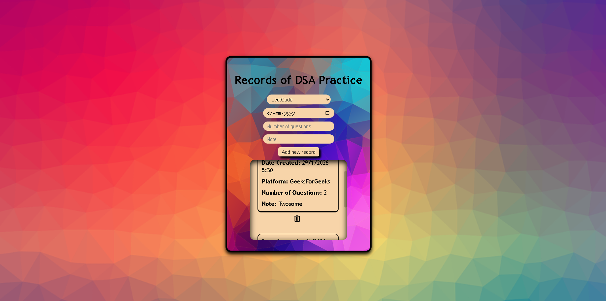

# Daily Records App (DSA Practice Tracker)

This is a simple full-stack **Express + MongoDB** application for tracking daily **DSA practice records**. The app allows you to add, view, and delete records such as platform used, date, number of questions solved, and notes — all rendered using **EJS** on the server.

---

## Tech Stack

**Backend**

* Node.js
* Express.js
* MongoDB (local instance)
* Mongoose

**Frontend**

* EJS (server-side rendering)
* Vanilla JavaScript
* CSS

**Utilities**

* method-override
* ejs-mate (layout support)

---

## Project Structure

```
Lv2_DailyRecordsAppDSA/
├── app.js                 # Main Express server
├── model/
│   └── model1.js          # Mongoose schema (StreetArt / Record model)
├── public/
│   ├── css/
│   │   └── index.css
│   └── js/
│       └── index.js
├── views/
│   └── index.ejs          # Main UI template
├── README.md
```

---




## Data Model

Each record stored in MongoDB has the following structure:

* **platform** – Practice platform (LeetCode, GFG, InterviewBit)
* **date** – Date of practice (defaults to current date)
* **numOfQuestions** – Number of questions solved
* **note** – Short note or comment

Defined using Mongoose:

* Collection name: `streetarts`

---

## Features

* Add new DSA practice records
* View all records sorted by date (latest first)
* Delete existing records with confirmation
* Server-side rendering using EJS
* Clean and minimal UI

---

## Prerequisites

Make sure you have the following installed:

* Node.js (v16+ recommended)
* npm
* MongoDB (running locally)

Verify MongoDB is running:

```bash
mongod
```

---

## Installation & Setup

1. Clone the repository

   ```bash
   git clone <repo-url>
   cd Lv2_DailyRecordsAppDSA
   ```

2. Install dependencies

   ```bash
   npm install
   ```

3. Start MongoDB (local)

   ```bash
   mongod
   ```

4. Run the application

   ```bash
   nodemon app.js
   ```

   or

   ```bash
   node app.js
   ```

5. Open in browser

   ```
   http://localhost:3000
   ```

---

## Routes Overview

| Method | Route         | Description          |
| ------ | ------------- | -------------------- |
| GET    | `/`           | Show all records     |
| POST   | `/`           | Add a new record     |
| DELETE | `/delete/:id` | Delete a record      |
| GET    | `/edit/:id`   | Edit route (UI stub) |

---

## How It Works (Flow)

1. User submits the form
2. Express receives POST `/`
3. Data is saved to MongoDB via Mongoose
4. User is redirected to `/`
5. Records are fetched, sorted, and rendered in EJS
6. Delete action uses Fetch API with HTTP DELETE

---

## Notes & Design Decisions

* Server-side rendering keeps the app simple and fast
* MongoDB is used locally for easy development
* No authentication — focused purely on daily tracking
* Minimal JavaScript on the client

---

## Possible Improvements

* Edit/update records
* Pagination
* Authentication
* Date-based analytics
* Charts for daily progress
* Deployment (Render / Railway)

---

## License

This project is built for learning and personal productivity.
